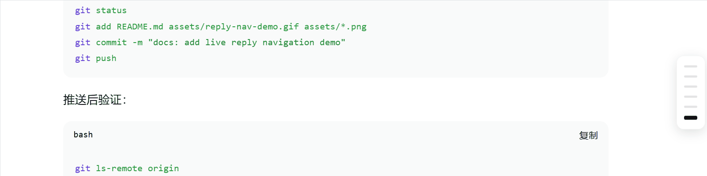

# dsh-reply-nav

**Turn long DeepSeek Harness chats into a navigable timeline.**

[中文 README](./README.md)



Add a slim round-level navigation rail to [DeepSeek Harness](https://github.com/deepseek-ai/deepseek-harness). Hover a bar to preview the explicit Markdown reply. Click it to jump straight to that user round—even when tool calls split the answer into many internal steps.

## Why it feels better

- **One bar per user round** — not per tool-split assistant step
- **Hover to preview** — scan rendered Markdown before opening the full exchange
- **Click to jump** — the matching round scrolls into view and stays highlighted
- **Small and native** — client-only, no backend, no build step, theme-aware

## Install in 30 seconds

```powershell
git clone https://github.com/nicolas-zhao-4/dsh-reply-nav.git
cd dsh-reply-nav
powershell -ExecutionPolicy Bypass -File ./install.ps1
```

Refresh the DSH Web page. On Linux/macOS, run `./install.sh` instead.

## Other install options

The installer copies the plugin into `<profile>/node_modules/` and idempotently adds the loader entry to `cordis.patch.yml`. The default profile is `web`.

For a manual install, copy `package.json` and `lib/` into `~/.dsh/profiles/<profile>/node_modules/dsh-reply-nav/`, then add:

```yaml
- insert:
    - id: reply-nav
      name: dsh-reply-nav
```

Or install from GitHub:

```bash
cd ~/.dsh/profiles/<profile>
npm i --no-save --package-lock=false github:nicolas-zhao-4/dsh-reply-nav
```

Add the patch above and refresh the page.

## Included / excluded

- **Included:** explicit reply text, rendered Markdown preview, round-level navigation
- **Excluded:** thinking/reasoning blocks and tool calls

## Verify and troubleshoot

- Refresh the page; the rail should appear on the right side of a long conversation
- Confirm `http://127.0.0.1:3080/plugins/dsh-reply-nav/client.js` returns `200`
- “Activated” in settings only confirms the Node side; check the browser console if the UI is missing

## How it works

The plugin registers a `shell.overlay` client UI and aggregates assistant text from each user round in the DSH session snapshot. The preview and jump behavior live entirely in `lib/client.js`; edit it and refresh.

## License

MIT
